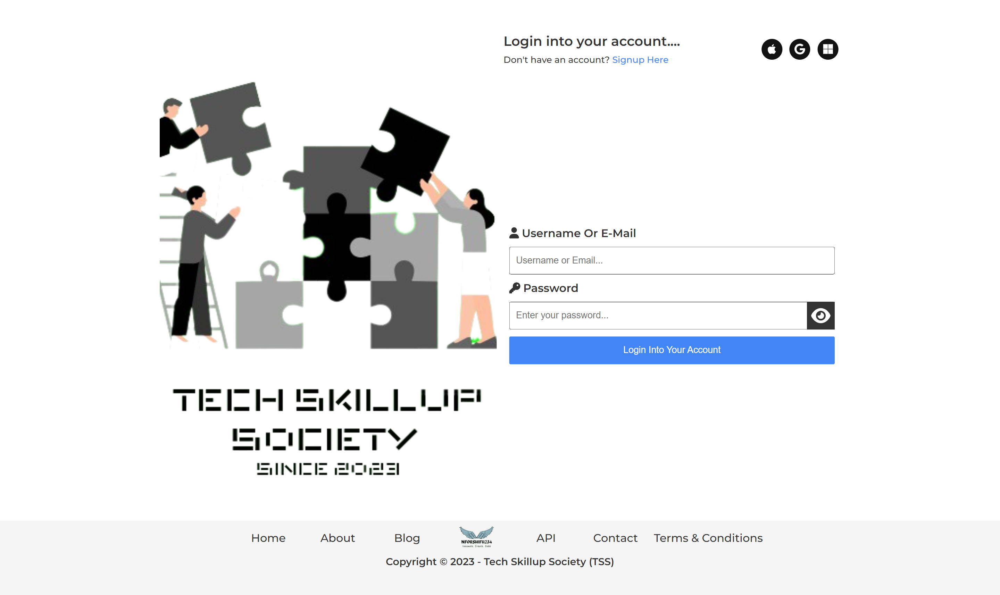
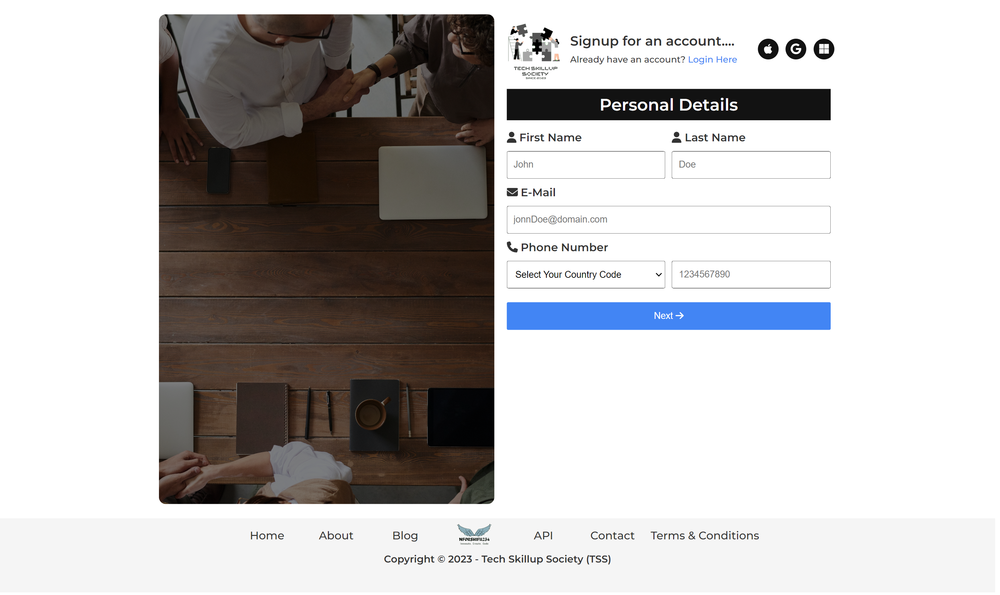
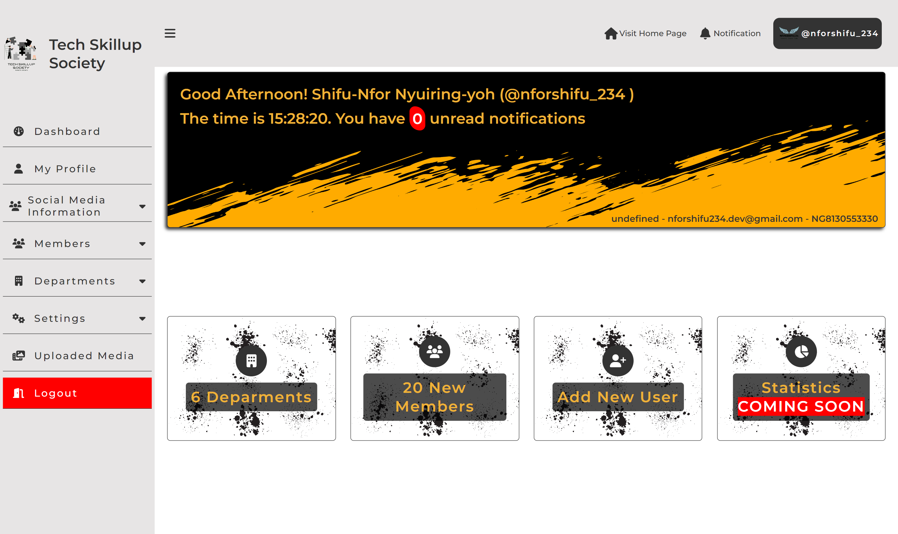

# TSS Login System

This is a login system, the community, TSS gave me from 01-07-2023 t0 08-o7-2023

# Languages Used

<ul>

<li>  Vanilla PHP </li>
<li>  HTML5 </li>
<li>  CSS3 </li>
<li>  Vanilla JS </li>

</ul>

# Icons Used

<ul>

<li>  Icons were gotten from Font Awesome (<a href="https://fontawesome.com/">https://fontawesome.com/</a>) </li>

</ul>

# Font Used

<ul>

<li>  The font used was Montserrat. Gotten from Google Fonts ( <a href="https://fonts.google.com/">https://fonts.google.com/</a> )  </li>

</ul>

# API's Used

<ul>

<li>  Rest Countries API ( <a href="https://restcountries.com/v2/all
">https://restcountries.com/v2/all
</a> )  </li>

<ul>
<li>This API helped during the signup process, It returns all the countries in the world, with thier names, county code  and country call code</li>
</ul>

</ul>

## Screenshots

Home Page

Login Page

Signup Page

Dashboard Page

# TSS Login System

This is a login system, the community, TSS gave me from 01-07-2023 t0 08-07-2023

## Authors

- [@nforshifu234dev](https://www.github.com/nforshifu234dev/)

